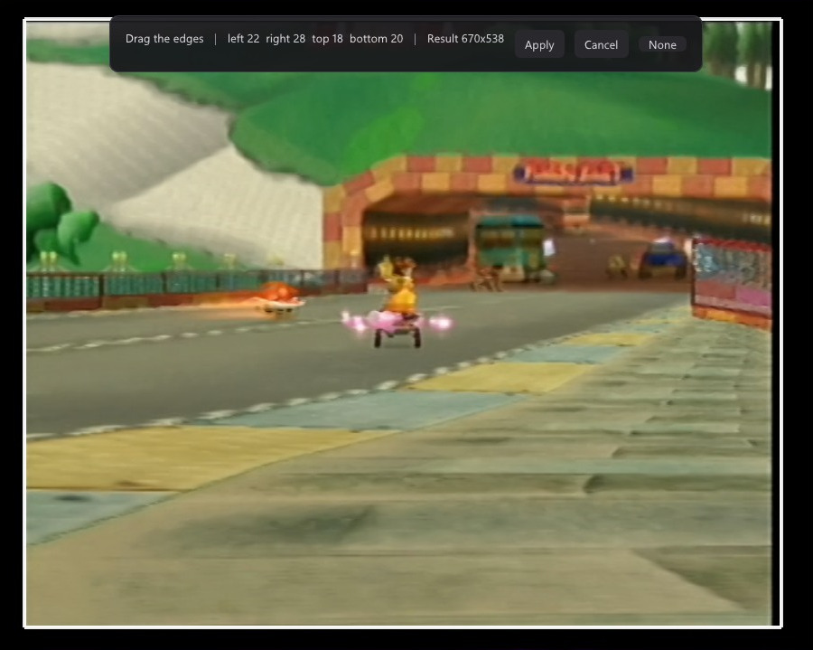
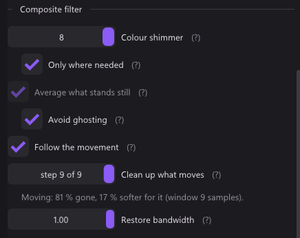

<p align="center">
  
</p>

<h1 align="center">qBlank</h1>

<p align="center">
  A low-latency viewer and recorder for DirectShow capture cards on Windows.
</p>


qBlank displays the output of a capture card with as little delay as the
hardware allows, so the captured signal can be played on rather than only
watched. Measured on a StarTech PEXHDCAP60L: **1080p60 sustained, around 1 ms
from a frame arriving to the present that hands it to the compositor.**

It is meant for using a capture card to play. Recording, screenshots, a
microphone track and a virtual camera are included; scenes, overlays,
compositing and streaming are not. For those, use OBS.

> **The [wiki](../../wiki) is the documentation** — one page per feature, what the
> code does and what was measured. This page is the list.

## Latency

- No queue in the capture path: triple buffer, late frames dropped.
- No graph clock, so nothing waits for a presentation time.
- Flip-model swap chain, maximum frame latency of one, tearing permitted, VSync off.
- Format conversion on the GPU: YUY2, UYVY, YVYU, NV12, planar 4:2:0, RGB, P010.

[Latency](../../wiki/Latency)

## Features

**Source** · [wiki](../../wiki/Source-and-signal)
- Any DirectShow video device.
- Resolution, rate, pixel format and colour space picked independently — undocumented but working combinations can be forced.
- Rate list carries *highest available* and *the signal's rate*.
- Analogue: video standard, input cable, and the driver's own property pages while the picture runs.

**Automatic video standard** · [wiki](../../wiki/Automatic-video-standard)
- Rechecked for as long as the program runs, not chosen once at startup.
- A colour round measures the picture — PAL B, PAL N and SECAM all fit 625 lines.
- 1.7–2.4 s from wrong to confirmed. **F7** searches by hand.

**Picture** · [wiki](../../wiki/Scaling-and-sharpening)
- Nearest, bilinear, Catmull-Rom, Lanczos3, sharp-bilinear.
- Contrast adaptive sharpening; brightness, contrast, saturation, hue.
- Aspect override, integer scaling, square pixels, quarter turns, line doubling for 240p and 288p.
- **Native pixel grid**: one output pixel per console pixel, where the card samples a line 720 times and a SNES drew 256.
- **Freeze** (**F11**) holds the source, so a slider can be judged on a still picture.
- **A/B compare** (**F12**) splits the picture, composite filters off on the left.
- **All filters off** (**Shift+F12**) shows the signal as it arrives, with deinterlacing, crop, aspect and range kept.

**Crop and colour range** · [wiki](../../wiki/Cropping-and-geometry)
- Dragged on the picture or found by **Detect** (**F8**).
- Measured across two seconds, so a fade to black is not read as shrinking.
- Counted in source pixels; dropped or kept per picture size when the source changes.
- Range and matrix measured from the image. **F6** measures again.




**Deinterlacing** · [wiki](../../wiki/Deinterlacing) — interlacing is measured, not believed.

| Mode | Vertical movement | |
|---|---|---|
| Off (weave) | none | combing on anything that moves |
| Bob | **1.0 line** | full rate, no latency, no interpolation |
| Bob interpolated | 0.56 | alternates sharp and interpolated lines |
| Motion adaptive | **0.005** | weaves what is still, interpolates what is not |
| Edge directed | 0.69 | follows edges; meant for pixel art |
| YADIF | **0.002** | best quality; keeps one frame in memory |


**Composite filter** · [wiki](../../wiki/The-composite-filter)
- **Four-frame average** clears dot crawl where the picture stands still, at no cost in sharpness.
- **Synchronous demodulator** takes over where it moves; **follow the movement** averages along the path.
- Weighted sideways average against colour shimmer; **restore bandwidth** puts back the rolled-off top of the band.
- Derived in the shader from the subcarrier period: right for PAL, PAL 60, NTSC, NTSC 4.43, PAL M and PAL N at any width. SECAM approximated.




**Cathode ray tube** — off by default, display only.
- Scanline gaps follow the **source's** line grid, not the screen's, and are absent where there is no room.
- **Source lines** says what the console drew, for a dongle handing over 1080 lines from 480.
- Aperture grille or shadow mask; both put back the brightness they take.


**High dynamic range** · [wiki](../../wiki/High-dynamic-range)
- P010 and P016 read against PQ (ST 2084) or HLG (BT.2100).
- BT.2390 tone mapping on an ordinary screen, scRGB on an HDR screen.
- Recording, screenshots and the camera tone map by default, or keep the range.

**Audio** · [wiki](../../wiki/Audio)
- Embedded card audio or any Windows recording device, out through WASAPI.
- Buffer target, optional exclusive mode, A/V offset.
- Clock drift corrected by nudging the playback rate a fraction of a per cent.
- Optional microphone on its own track, never played back.

**Recording** · [wiki](../../wiki/Recording)
- H.264, H.265 or AV1 through NVENC, Quick Sync, AMF, x264 or x265, encoded by ffmpeg.
- At source resolution: after crop and deinterlacing, before window scaling.
- Capture audio is the master clock — constant frame rate, 1 ms drift over 15 seconds.
- 60 to 50 Hz mid-recording **cuts the file and continues in a new one**.
- Rate control, preset, tuning, look-ahead, adaptive quantisation and multipass under one set of names.
- Free space shown as remaining recording time; a recording will not start on a full drive and stops itself before one fills up.

**Screenshots** · [wiki](../../wiki/Screenshots)
- At source resolution, taken **before the interface is drawn**.
- PNG and JPEG through Windows Imaging Component — **no ffmpeg needed**.
- HDR sources can keep their range as JPEG XR or AVIF.
- **Ctrl+F10** puts the shot on the clipboard instead of on disk.

**Virtual camera** · [wiki](../../wiki/Virtual-camera)
- Offered to other programs as **qBlank Virtual Camera**, at the source's own resolution and rate.
- Installing costs one UAC prompt.
- **Leave the reading program's resolution on automatic** — in OBS, *Resolution/FPS Type: Device Default*.

**Profiles**
- One per console: device, input, standard, capture format, picture and audio settings.
- **Ctrl+1** … **Ctrl+9** switch between them.
- A profile can say **which video standard means it** — same cable, two consoles, no keystroke.

**The settings window** · [wiki](../../wiki/The-settings-window)
- Its own window with its own Direct3D device, so it can go on a second monitor.
- An embedded panel remains, because a window capture in OBS cannot see a second window.
- Controls that cannot apply to the source are absent rather than disabled, and are not applied.

**Updates** · [wiki](../../wiki/Updates)
- Compares the build against the newest GitHub release.
- Installs by renaming, so a failed update leaves the program as it was.

## Shortcuts

| Key | Action | | Key | Action |
|---|---|---|---|---|
| Enter / Esc | Fullscreen on / off | | F9 | Start / stop recording |
| F1 | Statistics | | F10 | Screenshot |
| F2 | Settings | | Ctrl+F10 | Screenshot to clipboard |
| F5 | Restart capture | | F11 | Freeze |
| Shift+F5 | Reinitialise card | | F12 | Compare filters |
| F6 | Measure colour range | | Shift+F12 | All filters off |
| F7 | Detect video standard | | M | Mute |
| F8 | Detect border | | `+` `-` / wheel | Volume |
| | | | Ctrl+1 … Ctrl+9 | Switch profile |

Right click opens the menu. All except Esc, the profile digits and Alt+F4 are
reassignable under *Settings → Keys*. [Shortcuts](../../wiki/Shortcuts)

## ffmpeg

- Needed for **recording** and **HDR screenshots in AVIF**, nothing else.
- Preview, filters, deinterlacing, virtual camera and SDR screenshots run without it.
- Not bundled. *Settings → Encoder* downloads a static build and verifies its published SHA-256.
- Encoders are found by test-encoding two frames, not by reading `ffmpeg -encoders`.

[ffmpeg](../../wiki/ffmpeg)

## Limitations

- **One process holds a card's capture pin.** If OBS has it, qBlank cannot open it, and the other way round.
- **The virtual camera is invisible to packaged apps.** Its shared memory is in the session namespace, which an app container cannot see: not the Windows Camera app, not Store builds of Teams. OBS, Discord, browsers, vMix and XSplit find it.
- **S-Video and component have not been run.** Every analogue measurement was taken on composite, from a PAL SNES and a GameCube.
- **The HDR display path is untested on HDR hardware.** Tone mapping is verified; scRGB output has never met an HDR monitor.
- **SECAM is approximated.** Two alternating subcarriers against qBlank's single figure; the demodulator does not handle it at all.

## Building

Visual Studio 2022 with the Desktop C++ workload, and CMake. No external
dependencies; Dear ImGui is vendored in `third_party/`.

```bash
build.bat
```

- `qBlank.exe` lands in the repository root, about 2 MB, static CRT.
- `build.bat keep` retains the build tree, `build.bat debug` builds a debug configuration.
- Settings live in `qBlank.json` beside the executable; nothing goes into the registry.
- Prebuilt executables are attached to each [release](../../releases). [Building](../../wiki/Building)

## Why DirectShow

Cards with a Media Foundation driver also expose DirectShow; the reverse does not
hold, and older or semi-professional cards are often DirectShow only. On the
development machine DirectShow enumerates five video devices, Media Foundation
three.

## Coming from CapView

- Called CapView up to 3.7. Nothing has to be done by hand: *Settings → Updates* in 3.7 finds the release.
- Settings and profiles carry over; a `CapView.json` beside the program is adopted, not replaced.
- Each release ships a small `CapView.exe` so the 3.7 updater finds an asset under the name it looks for.
- The virtual camera has to be installed again — it is registered under a new name.

## Licence

**GNU General Public License, version 3 or later.** Use it for anything,
including at work and including making money with it; if you pass it on,
modified or not, it goes on under the same terms and with the source. Full text
in [LICENSE](LICENSE).

Up to and including 3.7 the program was MIT, and copies taken while that applied
keep MIT. Dear ImGui is MIT and stays MIT; see
[THIRD-PARTY.md](THIRD-PARTY.md). ffmpeg is a separate program, downloaded from
upstream and run as a child process, not linked in.

Written with the help of [Claude](https://claude.ai).
